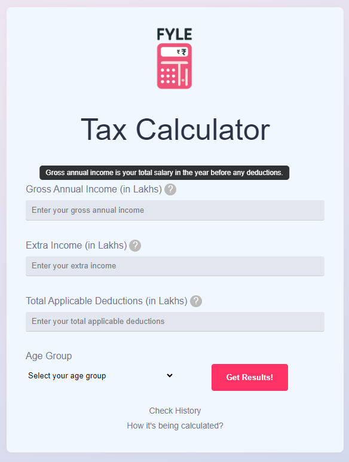
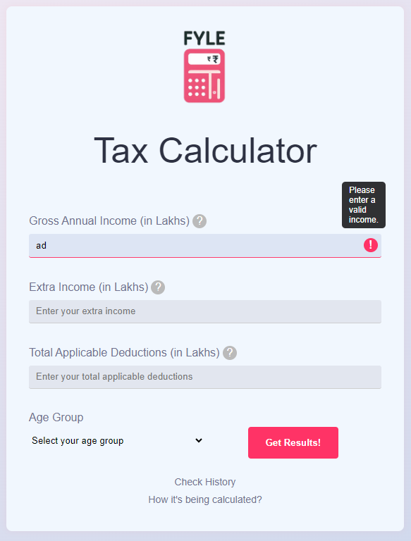
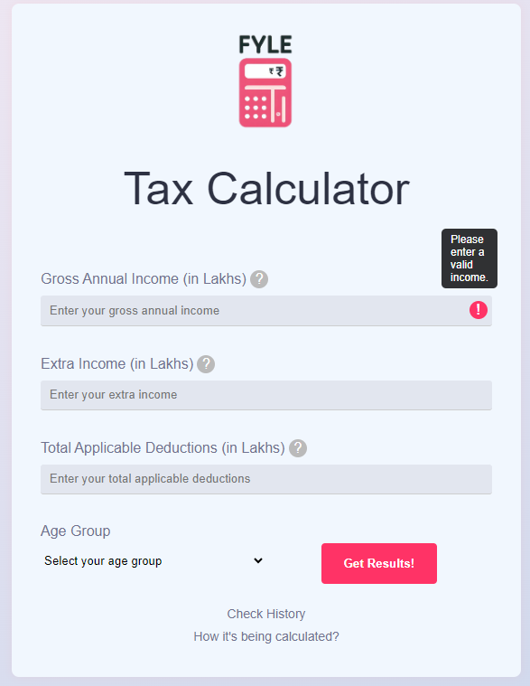
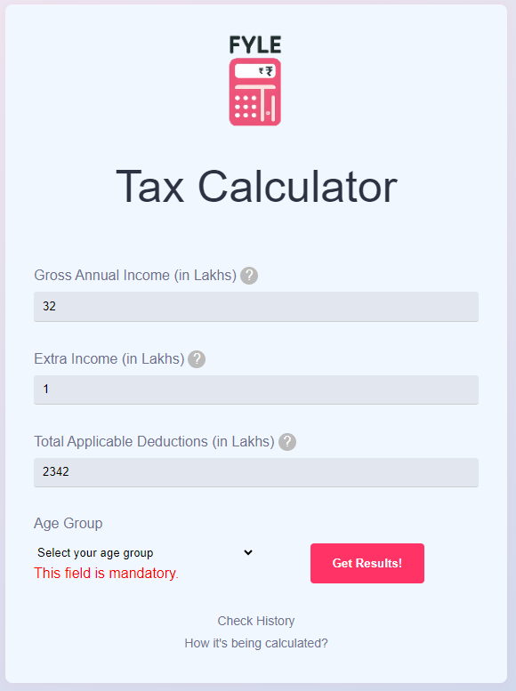
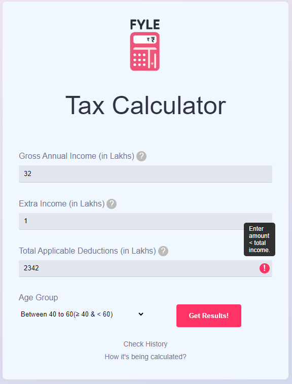
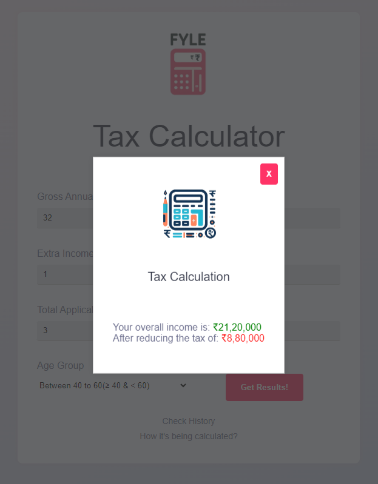
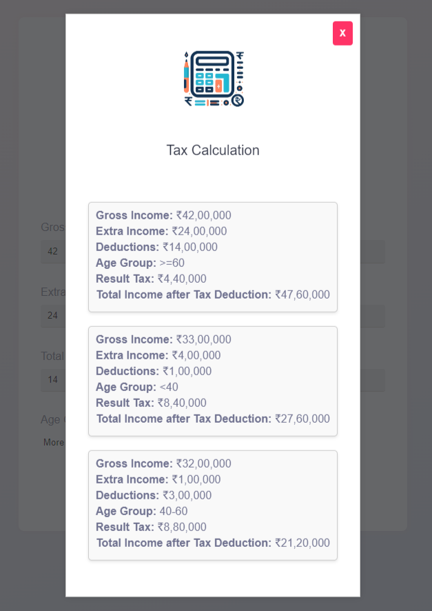

# Tax Calculator

This is a simple web-based tax calculator application that helps users calculate their income tax based on their gross annual income, extra income, applicable deductions, and age group. The application also allows users to view their tax calculation history.

*Screenshot 1: Beautiful UI inspired from Fyle website*

## Features

- Calculate income tax based on user input.
- Validate user inputs for gross annual income, extra income, deductions, and age group.
- Display calculation details including total income after tax deduction and tax amount.
- View tax calculation history.
- Provides explanation on how the tax calculation works.

## Technologies Used

- HTML
- CSS
- JavaScript
- jQuery

## Installation

1. Clone the repository: `git clone https://github.com/your-username/tax-calculator.git`
2. Open the `index.html` file in your web browser.

## Usage

1. Enter your gross annual income (in Lakhs), extra income (in Lakhs), total applicable deductions (in Lakhs), and select your age group.
2. Click on the "Get Results!" button to calculate the tax.
3. View the tax calculation result displayed on the screen.
4. Click on the "How it's being calculated?" link to understand the tax calculation process.
5. To view the tax calculation history, click on the "Check History" link.

# Deployed at:
https://tax-calculation-assignment.vercel.app/

## Screenshots

*Screenshot 2: Shows input detail when hover over "?" (Tooltip)*

*Screenshot 3: Only positive numbers allowed*

*Screenshot 4: Cannot submit empty fields*

*Screenshot 5: Each field is required*

*Screenshot 6: Deductions cannot be more than total income*

*Screenshot 7: Modal display results on valid inputs*

*Screenshot 8: Can check last 3 calculation history*

